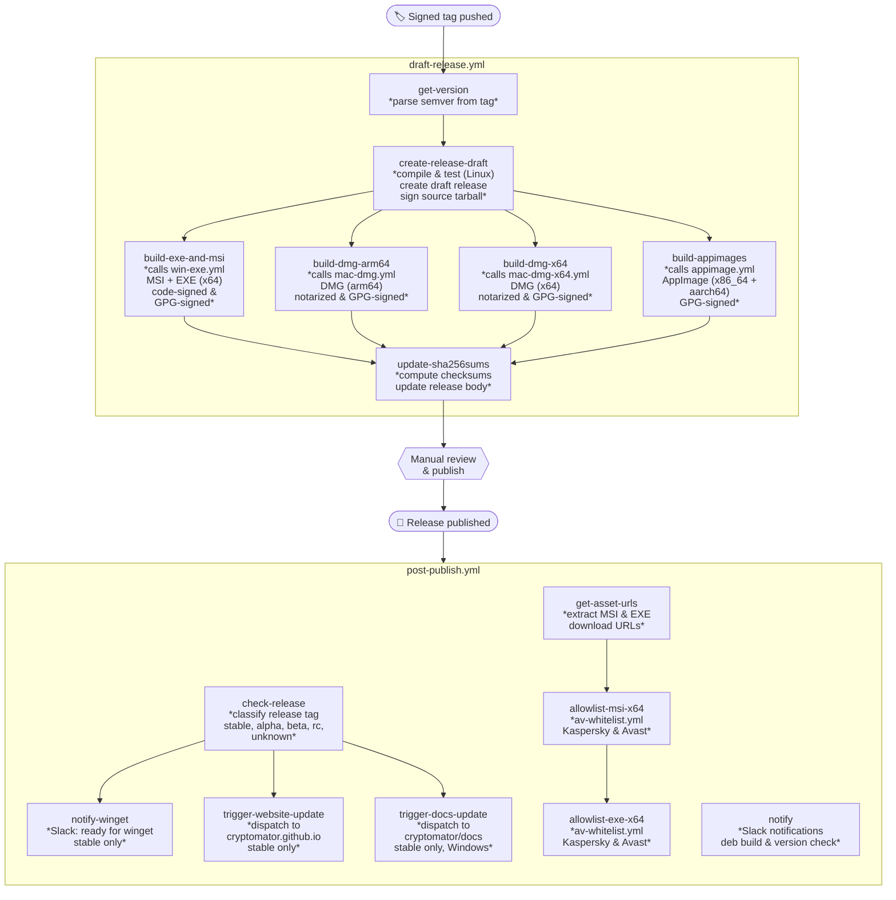

# Cryptomator Release Workflow

This document describes the automated release pipeline defined in [`draft-release.yml`](draft-release.yml) and [`post-publish.yml`](post-publish.yml).

## Overview

The release process has two phases:

1. **Draft phase** (`draft-release.yml`) -- triggered by pushing a signed git tag. Compiles, tests, builds platform installers, and creates a **draft** GitHub Release.
2. **Post-publish phase** (`post-publish.yml`) -- triggered when the draft release is manually **published**. Submits Windows installers for AV whitelisting, notifies the team for DEB build and latest-version update, and triggers downstream updates (website, docs, winget).

## Phase 1: Draft Release (`draft-release.yml`)

**Trigger:** push of any tag (`*`)

### Jobs

| Job | Runs on | Description |
|-----|---------|-------------|
| **get-version** | ubuntu | Parses the tag into semver components (`semVerNum`, `semVerSuffix`, `revNum`, `versionType`). The release is aborted if not an alpha, beta, rc or 'stable' release. |
| **create-release-draft** | ubuntu | Checks out the repo, verifies the tag is **signed** and lives on a `main` or `release/*` branch. Runs `./mvnw verify` (with `xvfb-run`). Creates a GitHub Release **draft** using the [release body template](../release-body.md.template). Downloads and GPG-signs the source tarball. |
| **build-exe-and-msi** | windows | Calls [`win-exe.yml`](win-exe.yml). Builds the MSI and EXE bundle installer for x64 Windows. Code-signed via Azure Trusted Signing, GPG-signed, and uploaded to the draft release. Outputs SHA-256 checksums. |
| **build-dmg-arm64** | macos-15 | Calls [`mac-dmg.yml`](mac-dmg.yml). Builds the DMG for Apple Silicon. Code-signed, notarized with Apple, GPG-signed, and uploaded. Outputs SHA-256 checksum. |
| **build-dmg-x64** | macos-15-large | Calls [`mac-dmg-x64.yml`](mac-dmg-x64.yml). Same as above but for Intel Macs. Uses macFUSE instead of FUSE-T. |
| **build-appimages** | ubuntu | Calls [`appimage.yml`](appimage.yml). Builds AppImages for x86_64 and aarch64 (matrix). GPG-signed and uploaded with `.zsync` delta-update files. Outputs SHA-256 checksums. |
| **update-sha256sums** | ubuntu | Runs after all builds complete. Computes the source tarball checksum, collects all artifact checksums, and updates the draft release body via `envsubst`. Replaces the "builds still running" banner with a success notice. |

### Release Artifacts

After the draft phase, the GitHub Release contains:

| Artifact | Platform |
|----------|----------|
| `cryptomator-<ver>.tar.gz.asc` | Source (GPG signature) |
| `Cryptomator-<ver>-x64.msi` + `.asc` | Windows |
| `Cryptomator-<ver>-x64.exe` + `.asc` | Windows |
| `Cryptomator-<ver>-arm64.dmg` + `.asc` | macOS (Apple Silicon) |
| `Cryptomator-<ver>-x64.dmg` + `.asc` | macOS (Intel) |
| `cryptomator-<ver>-x86_64.AppImage` + `.zsync` + `.asc` | Linux (x86_64) |
| `cryptomator-<ver>-aarch64.AppImage` + `.zsync` + `.asc` | Linux (aarch64) |

All artifacts are signed with GPG key [`615D449FE6E6A235`](https://gist.github.com/cryptobot/211111cf092037490275f39d408f461a).

## Manual Review Gate

After the draft phase completes, a maintainer reviews the draft release on GitHub. This is the point to:

- Verify all artifacts are present and checksums look correct.
- Edit the auto-generated release notes (What's New, Bugfixes, Other Changes).
- **Publish** the release when ready, which triggers phase 2.

## Phase 2: Post-Publish (`post-publish.yml`)

**Trigger:** `release: [published]`

### Jobs

| Job | Condition | Description |
|-----|-----------|-------------|
| **notify** | always | Sends Slack notifications to `#cryptomator-desktop`: ready to build `.deb` package, and reminder to update `latest-version.json` on S3. |
| **get-asset-urls** | always | Extracts MSI and EXE download URLs from the release assets. |
| **check-release** | always | Classifies the published release tag as `stable`, `alpha`, `beta`, `rc`, or `unknown`. Stable-only follow-up jobs depend on this output. Unlike `get-version.yml` workflow, this job does not perform semver validation. |
| **allowlist-msi-x64** | Windows release | Calls [`av-whitelist.yml`](av-whitelist.yml). Uploads the MSI to Kaspersky and Avast for whitelisting. |
| **allowlist-exe-x64** | Windows release | Same as above for the EXE. Runs sequentially after MSI. |
| **notify-winget** | stable + Windows | Sends a Slack notification that the release is ready for [winget submission](winget.yml). |
| **trigger-website-update** | stable | Dispatches `desktop-release` event to `cryptomator/cryptomator.github.io`. |
| **trigger-docs-update** | stable + Windows | Dispatches `desktop-release` event to `cryptomator/docs`. |

### Manual Follow-ups

These steps are triggered by team members after Slack notifications:

- **Debian package** -- Run the [`debian.yml`](debian.yml) workflow to build `.deb` and optionally upload to the PPA.
- **winget** -- Run the [`winget.yml`](winget.yml) workflow to submit to the Windows Package Manager.
- **latest-version.json** -- Update the version-check file on S3 (`static.cryptomator.org/desktop/latest-version.json`).

## Signing & Security

- **Git tag** must be SSH-signed and reside on `main` or `release/*`.
- **Windows** installers are code-signed using Azure Trusted Signing.
- **macOS** DMGs are code-signed with an Apple Developer certificate and notarized via `notarytool`.
- **All artifacts** receive a detached GPG signature (`.asc`) using key `615D449FE6E6A235`.
- **AV whitelisting** is submitted to Kaspersky and Avast after publish (Windows installers only).
- The draft release is created using `CRYPTOBOT_RELEASE_TOKEN`, not `GITHUB_TOKEN`, to ensure proper permissions and trigger downstream workflows.
